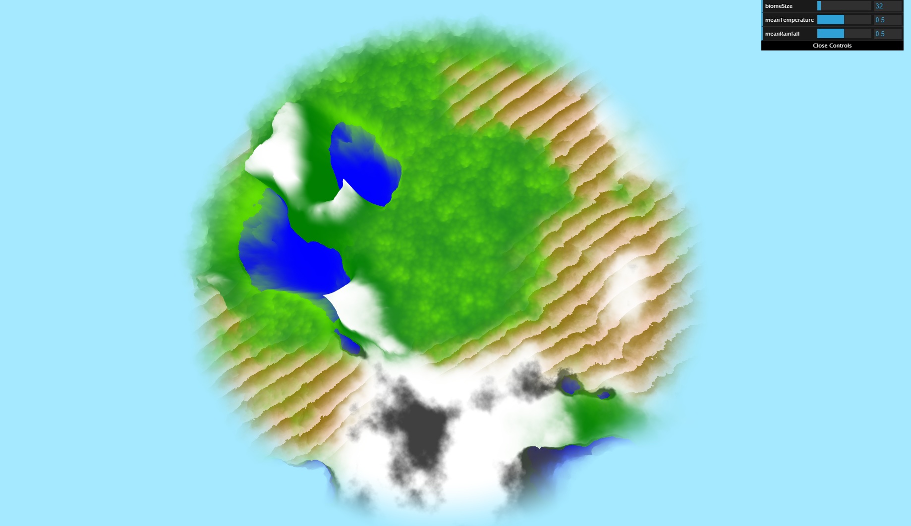

# CIS 566 Homework 1: Noisy Terrain
_Wei (Waley) Zhang (PennKey: wzha)_

[github.io Demo]()

## Features
- __Four biomes__ My world contains the following biomes:
  - Tundra: implemented using summed fractal brownian motion (FBM) with a standard noise function with quintic falloff for interpolation.
  - Desert: implemented using summed FBM with first order domain warping (ie. a FBM of FBMs) with a standard noise function with quintic falloff for interpolation.
  - Freshwater & Mountains: implemented using summed FBM with a perlin noise function with quintic falloff for interpolation.
  - Rainforest: implemented using summed FBM with a worley noise function clamped to fixed maximum value, then transformed via a bias function with base 0.8.

- __Smooth transitions between biomes__ The biome positions are controlled by two terrain attributes: temperature and rainfall. These two terrain attributes form a 2D space partitioned into four zones, one for each biome. A summed FBM with a clamped noise function produces the values for temperature and rainfall at each x-z position in world space. This noise function has a quintic falloff for interpolation purposes. The temperature and rainfall values at each x-z position are used to interpolate between all four biomes using a gain function with base 0.9999 (a high base value means a transition will only be noticeable near the edges of a biome). These interpolated values form the height and color field of my world.

- __Elevation-based characteristics within biomes__ Within each biome, the elevation at each x-z position controls the characteristics at that position, as follows:
  - Tundra: rocky/barren landscape at low elevations, glacier/ice landscape at higher elevations. Transition is controlled via a (cubic) smoothstep function.
  - Desert: the world position _and_ elevation are both used to create shadowy lines, akin to those seen on a sand dune. The shadow is controlled via a (cubic) smoothstep function.
  - Freshwater & Mountains: water at low elevations, grass/forest at middle elevations, and snow near the mountain peaks. Transition between grass/forest and snow is controlled via a (cubic) smoothstep function.
  - Rainforest: fresh grass at low elevations, dark canopy at higher elevations. Transition is controlled via a (cubic) smoothstep function.
  - Distance fog: a fog obscures the view range beyond a fixed distance. Transition between non-fog and fog is controlled via a (cubic) smoothstep function.

- __User controls of biome characteristics via dat.GUI__ The user can control three characteristics about the biomes via dat.GUI: biome size (`biomeSize` variable), average temperature (`meanTemperature` variable), and average rainfall (`meanRainfall` variable). Low average temperature combined with low average rainfall results in a higher proportion of the tundra biome. High average temperature combined with low average rainfall results in a higher proportion of the desert biome. Low average temperature combined with high average rainfall results in a higher proportion of the freshwater & mountain biome. High average temperature combined with high average rainfall results in a higher proportion of the rainforest biome.

## Citation
I did not use any external resources when implementing this assignment.
